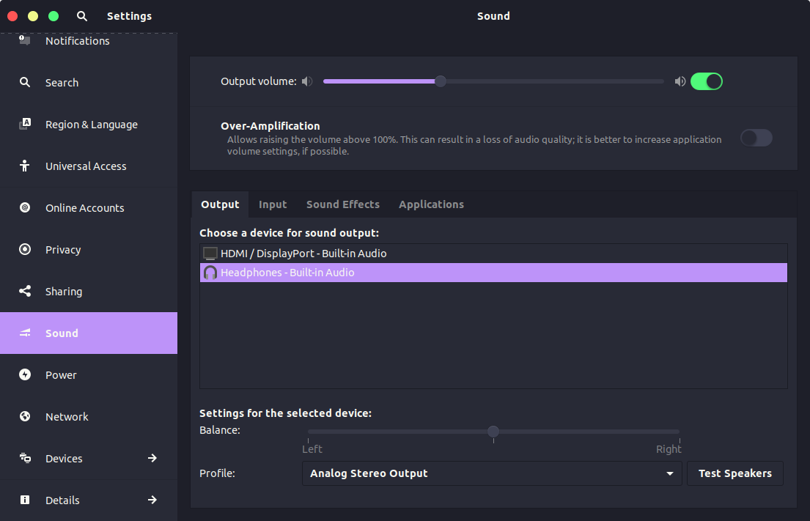

# Ant-Dracula-Purple



## Install
```sh
git clone https://github.com/mateus4k/Ant-Dracula-Purple/
mv Ant-Dracula-Purple ~/.themes
gsettings set org.gnome.desktop.interface gtk-theme "Ant-Dracula-Purple"
gsettings set org.gnome.desktop.wm.preferences theme "Ant-Dracula-Purple
```
Remember to create the _.themes_ folder inside your _home_ if not exists!

## Note:
- This theme is based on the [evopop-gtk-theme](https://github.com/solus-project/evopop-gtk-theme).
